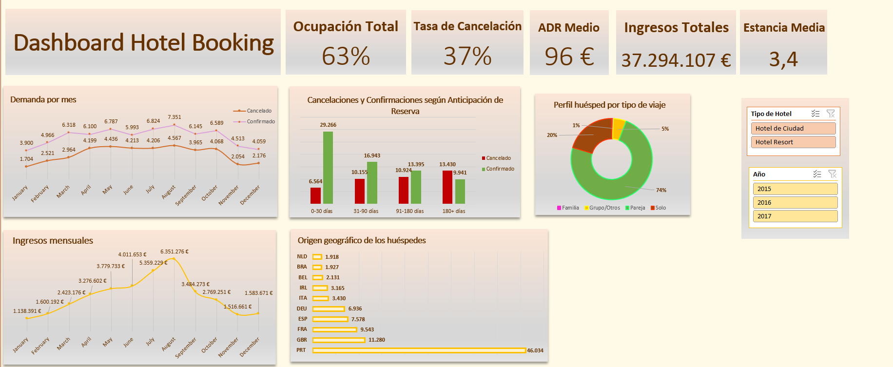

## 📊 Proyecto Final: Dashboard y Análisis de Datos - Hotel Booking Demand

## 📖 Descripción del proyecto

Este proyecto consiste en el análisis exploratorio de un conjunto de datos de reservas hoteleras con el objetivo de identificar patrones de demanda, ingresos, cancelaciones y perfil del cliente.

La pregunta de negocio principal es:

**¿Cómo podemos optimizar la ocupación y los ingresos del hotel minimizando el impacto de las cancelaciones?**

El análisis está dirigido principalmente al **Director General del Hotel** y al **Jefe de Reservas**, ya que la información obtenida puede ayudarles a:

- decidir si deben subir o bajar precios en función del ADR
- revisar la política de cancelación
- identificar en qué países conviene invertir más publicidad
- mejorar la previsión de ocupación en función de la estacionalidad

Para desarrollar este proyecto se ha utilizado **Excel** y **Power Query**, realizando limpieza, transformación, análisis descriptivo y construcción de un dashboard interactivo.

---

## Objetivos

### Objetivo principal
Analizar cómo optimizar la ocupación y los ingresos del hotel minimizando el impacto de las cancelaciones.

### Objetivos secundarios
- Identificar los meses de mayor demanda.
- Comprender mejor el perfil del cliente.
- Analizar la nacionalidad de los huéspedes.
- Estudiar el efecto de la antelación de reserva sobre las cancelaciones.

---

## 📂 Fuente de datos

El dataset utilizado es **Hotel Booking Demand**, extraído de un archivo CSV/Excel obtenido a través de Kaggle con fines académicos.

**Fuente:**  
Hotel booking demand datasets (Data in Brief, 2019)  
Kaggle: https://www.kaggle.com/datasets/mojtaba142/hotel-booking/discussion

El conjunto de datos contiene aproximadamente **119.000 reservas** correspondientes a dos tipos de hotel:

- **City Hotel**
- **Resort Hotel**

Incluye variables relacionadas con:

- tipo de hotel
- fecha de llegada
- duración de la estancia
- número de huéspedes
- tipo de cliente
- segmento de mercado
- país de origen
- ADR
- estado de la reserva
- tipo de depósito
- peticiones especiales

---

## 📁 Estructura del proyecto

```text
├── Dashboard_Hotel_Booking.png          # Captura del dashboard
├── README.md                            # Documentación del proyecto
├── hotel_booking_demand.csv.xlsx        # Dataset original
└── hotel_booking_dashboard_final.xlsx   # Archivo final de Excel con dataset, tablas dinámicas y dashboard
```

---

## 🛠️ Limpieza y transformación de datos

Antes de realizar el análisis se llevó a cabo un proceso de limpieza y preparación de los datos en **Power Query**.

### Tratamientos realizados

1. **Traducción de encabezados al español**.
2. **Eliminación de columnas** con datos personales o poco relevantes para el análisis.
3. **Creación de la columna _Fecha_de_llegada_**.
4. **Detección y eliminación de outliers**:
   - se eliminaron reservas donde `adults + children + babies = 0`
   - se eliminaron valores extremos en `children`, `babies` y `adults` al superar rangos lógicos
5. **Tratamiento de valores nulos**:
   - en la columna **País**, se reemplazaron por **Desconocido**
   - se detectaron nulos en **Agente** y **Compañía**
   - en **Tipo de Depósito**, los nulos se imputaron como **Desconocido**
6. **Creación de nuevas variables derivadas**:
   - `Estancia_Días_Total`
   - `Tarifa_Total`
   - `Grupo_Días_Antelación_Reserva`
   - `Tipo_de_Viaje`

---

## 📌 KPI principales

Los indicadores clave del dashboard son:

- **Ocupación Total:** número de reservas confirmadas
- **ADR Medio:** precio medio diario por habitación
- **Tasa de Cancelación (%):** porcentaje de reservas anuladas frente al total
- **Estancia Media:** promedio de noches que se quedan los huéspedes
- **Revenue / Ingresos Totales:** estimación del dinero generado

### Valores obtenidos

- **Ocupación Total:** 63 %
- **Tasa de Cancelación:** 37 %
- **ADR Medio:** 96 €
- **Ingresos Totales:** 37.294.107 €
- **Estancia Media:** 3,4 noches

---

## 📊 Análisis del dashboard

### 1. Demanda por mes
Se observa una fuerte estacionalidad en las reservas. Los meses de **julio** y **agosto** concentran el mayor volumen de reservas confirmadas, aunque también presentan un número elevado de cancelaciones.

**Interpretación:** existe una alta demanda en verano, pero también mayor riesgo de pérdida de ocupación por cancelaciones.

### 2. Ingresos mensuales
Los ingresos siguen una evolución ascendente hasta alcanzar su máximo en **agosto**, descendiendo después del verano.

**Interpretación:** la rentabilidad del hotel está claramente concentrada en la temporada alta.

### 3. Cancelaciones según anticipación de reserva
Se agruparon las reservas según su antelación:

- **0-30 días**
- **31-90 días**
- **91-180 días**
- **180+ días**

Se observó que:

- las reservas con menor anticipación presentan muchas más confirmaciones que cancelaciones
- las reservas con más de 180 días presentan más cancelaciones que confirmaciones

**Interpretación:** cuanto mayor es la antelación de reserva, mayor es la probabilidad de cancelación.

### 4. Perfil del huésped
El perfil del huésped muestra que predominan las reservas de **parejas**, seguidas por viajeros **solos**. Las familias y los grupos representan una parte menor del total.

**Interpretación:** el hotel está orientado principalmente a parejas y viajeros individuales.

### 5. Origen geográfico de los huéspedes
El gráfico de nacionalidad muestra una fuerte concentración en:

- **Portugal**
- **Reino Unido**
- **Francia**
- **España**
- **Alemania**

**Interpretación:** el hotel depende principalmente del mercado europeo cercano, especialmente del mercado portugués.

---

## 🖥️ Dashboard final



---

## 📈 Resultados y conclusiones

Los principales hallazgos del proyecto son:

- la demanda hotelera presenta una clara estacionalidad, con máximos en verano
- las cancelaciones representan un problema importante, ya que alcanzan el **37 %** del total
- las reservas hechas con mucha antelación tienen una mayor probabilidad de cancelación
- agosto es el mes con mayor generación de ingresos
- el perfil del cliente está dominado por parejas y viajeros individuales
- la principal procedencia geográfica de los huéspedes es Portugal, seguido de otros países europeos

En conjunto, el análisis muestra que mejorar la gestión de las cancelaciones y reforzar la estrategia comercial en temporada alta puede tener un impacto directo en la ocupación y en los ingresos del hotel.

---

## 🔄 Próximos pasos

Como posibles mejoras futuras del proyecto, se podrían realizar los siguientes análisis:

- estudiar con más detalle el impacto del **segmento de mercado** sobre las cancelaciones
- analizar si el **tipo de depósito** influye en la estabilidad de la reserva
- explorar la relación entre **peticiones especiales** y perfil del cliente
- desarrollar el dashboard en **Power BI** para ampliar la interactividad

---

## 🤝 Contribuciones

Este proyecto ha sido realizado con fines académicos. Aun así, se pueden plantear mejoras futuras relacionadas con el análisis o el diseño del dashboard.

---

## ✒️ Autor

Proyecto realizado por: **Bella Laya**
GitHub: [bellalaya80-max] (https://github.com/bellalaya80-max)
---

## 🙏 Agradecimientos

Gracias a la plataforma **Kaggle** por proporcionar el dataset y al material del curso por servir de guía en el desarrollo del proyecto.


